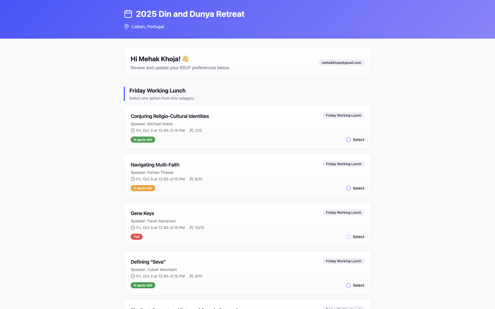

🌟 Innovators Retreat

The Innovators Retreat System was built to manage participants, sessions, bios, and communications for a multi-day retreat.
It combined Airtable, custom automations, interfaces, and personalized emails into one unified system that made retreat operations seamless.

📖 Overview

Running a global retreat requires more than just a spreadsheet — it requires a system that can:

Track participant records and session RSVPs

Collect and update participant bios

Automate routine communications

Provide interfaces for organizers to work efficiently

Keep data synced across all stakeholders

This platform achieved exactly that.

🚀 Key Features
👤 Participant Records

Master database of all retreat participants

Linked records for roles (e.g., moderator, panelist, attendee)

Editable bios connected to each participant

📄 Bio Collection & Updates

Participants received prefilled forms to update or confirm their bios

Submitted bios synced directly back to Airtable

Organizers could review, approve, or edit bios in one place

📅 Session RSVP & Attendance

Central RSVP system to manage attendance across sessions

Chronological view of events for participants

Capacity limits enforced automatically (e.g., workshops, meals)

Locked sessions prevented last-minute changes unless cleared by staff

📧 Automated Emails

Personalized HTML emails generated via Airtable + Zapier

Each participant received:

Links to their RSVP forms

Profile update links

Event-specific reminders

🖥️ Interfaces for Organizers

Airtable interfaces for reviewing bios, RSVPs, and attendance

Quick search and filter tools to find specific participants

Single-click review and approval workflows

🛠️ Tech Stack

Data Layer: Airtable (records, sessions, bios, RSVPs)

Frontend: Airtable Interfaces + prefilled form views

Automations:

Airtable scripting for record updates and capacity enforcement

Zapier for personalized HTML emails

Email Delivery: Mailchimp + custom Zapier workflows

📸 Example Screens

🚀 Impact

Managed all retreat participant data in a single source of truth

Collected and reviewed hundreds of participant bios smoothly

Automated communication reduced manual email work to near zero

Interfaces enabled retreat organizers to work faster and more confidently

🧠 Lessons Learned

Built scalable Airtable systems with linked records, forms, and automations

Learned how to design for sustainability — so the retreat can rerun without rebuilding

Balanced participant experience (simple forms + emails) with organizer needs (powerful data tools)
